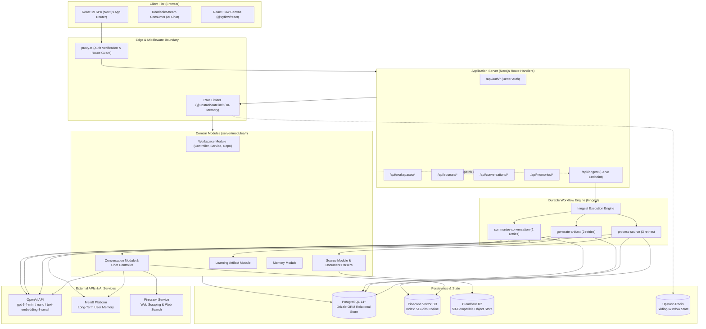
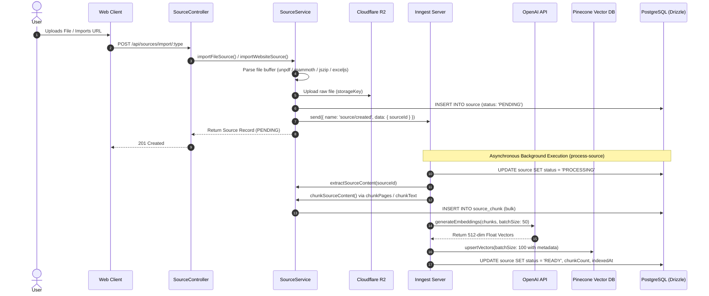
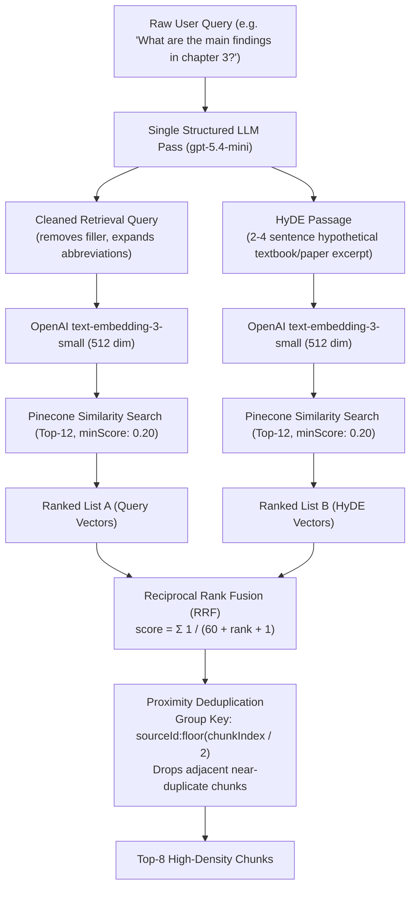
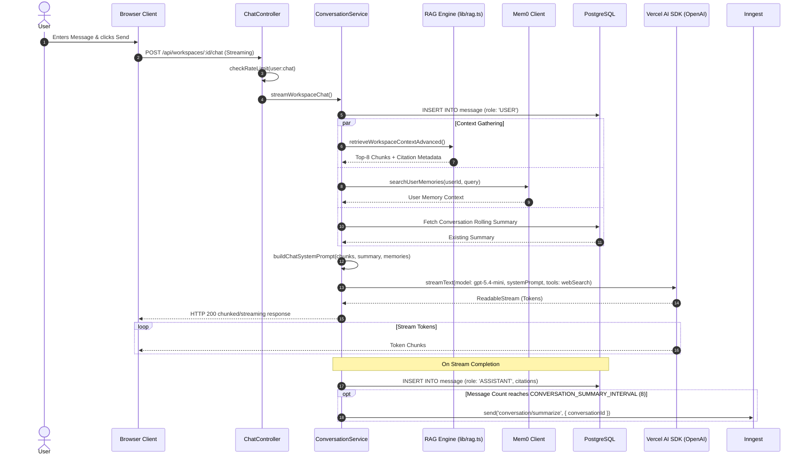

# Flux Technical Architecture

This document provides an in-depth engineering specification of **Flux** (`flux`), detailing system topology, data structures, asynchronous pipelines, retrieval algorithms, security boundaries, and architectural trade-offs.

---

## 1. Architecture Overview

Flux is built as a modular, domain-driven full-stack application using **Next.js 16 (App Router)**, **React 19**, **Drizzle ORM**, **PostgreSQL**, **Pinecone**, and **Inngest**. The system is structured around the concept of isolated **Workspaces**, which act as strict security and context boundaries for ingested documents, vector embeddings, chat histories, and synthesized learning artifacts.

The architecture emphasizes three core engineering principles:

1. **Decoupled Heavy Computation**: Document extraction, layout parsing, vector embedding generation, rolling memory summarization, and artifact synthesis are completely decoupled from synchronous request handlers. They execute as durable, multi-step background jobs orchestrated by Inngest.
2. **Zero-Join Vector Retrieval**: Document chunks are stored with their raw text and citation metadata directly inside Pinecone vector records. During RAG search, candidate chunks are retrieved, fused, and injected into the LLM context in a single round-trip without requiring secondary relational database joins.
3. **Multi-Stage Grounded Retrieval**: Queries undergo HyDE (Hypothetical Document Embeddings) expansion, parallel vector retrieval, Reciprocal Rank Fusion (RRF), and proximity deduplication before being passed to the LLM.



---

## 2. Components & Layered Structure

The codebase strictly enforces clean architecture with separation of concerns:

```text
Request → [proxy.ts Middleware] → [Route Handler] → [Controller] → [Service] → [Repository] → [Database / External API]
```

### 2.1 Route Handlers & Controllers (`app/api/*`, `server/modules/*/*.controller.ts`)
- **Responsibility**: HTTP parameter extraction, input parsing via Zod schemas, rate-limit enforcement, session extraction, and dispatching to services.
- **Envelope Standardization**: Responses are wrapped in a uniform JSON schema (`{ success: true, data }` or `{ success: false, error, details }`).
- **Error Handling**: Catches domain `ApiError` instances and translates them into appropriate HTTP status codes (400, 401, 403, 404, 429, 500).

### 2.2 Domain Services (`server/modules/*/*.service.ts`)
- **WorkspaceService**: Enforces user ownership of workspaces. Cascades workspace operations.
- **SourceService**: Orchestrates file parsing, Cloudflare R2 uploads, chunk generation, and dispatching Inngest background jobs. Includes an automatic fallback to local async execution if the Inngest daemon is offline.
- **ConversationService**: Implements RAG streaming logic, system prompt assembly with context injection, rolling summary maintenance, and Mem0 memory synchronization.
- **LearningArtifactService**: Manages the life cycle of synthesized flashcards, quizzes, mindmaps, summaries, and reports.
- **MemoryService**: Interfaces with Mem0 to create, query, update, and delete user long-term memories.

### 2.3 Repositories (`server/modules/*/*.repository.ts`)
- Encapsulate all database interaction using **Drizzle ORM**.
- Provide strongly typed query boundaries, isolating database table specifics from business services.

### 2.4 Ingestion Parsers (`lib/file-parser.ts`, `lib/youtube.ts`, `lib/firecrawl.ts`)
- **PDF Parser (`lib/pdf.ts`)**: Built on `unpdf` to extract textual content while tracking page offsets.
- **DOCX Parser (`lib/file-parser.ts`)**: Uses `mammoth` to extract raw text and convert styling into HTML for rich previewing.
- **PPTX Parser (`lib/file-parser.ts`)**: Unzips PowerPoint presentation archives via `JSZip`, parses slide XML (`ppt/slides/slide*.xml`), and structures slide titles and bullet points.
- **XLSX Parser (`lib/file-parser.ts`)**: Leverages `exceljs` to parse workbooks, normalize row/column widths, and extract tabular data.
- **YouTube Parser (`lib/youtube.ts`)**: Validates video IDs, queries the YouTube oEmbed API for metadata (title, author, thumbnail), fetches caption segments via `youtube-transcript`, applies heuristic timescale detection (milliseconds vs. seconds), and formats output into timestamped Markdown.
- **Web Scraper (`lib/firecrawl.ts`)**: Connects to the Firecrawl API to extract clean Markdown stripped of navigation bars, footers, and scripts.

---

## 3. Data Flow & Core Pipelines

### 3.1 Document Ingestion & Vector Indexing Pipeline



### 3.2 Advanced RAG Retrieval Pipeline (HyDE + RRF)

Rather than performing a direct vector search on raw user prompts, Flux implements a multi-stage retrieval algorithm:



1. **Batched Enhancement**: A single structured output call generates both an `enhancedQuery` (stripping conversational filler) and a `hydePassage` (a hypothetical authoritative answer).
2. **Parallel Embedding & Search**: Both vectors are created in parallel via `Promise.all` and queried against Pinecone filtered by `workspaceId` (and optional `sourceIds`).
3. **Reciprocal Rank Fusion (RRF)**: Merges the two ranked lists using the standard formula:
   $$RRF\_Score(d) = \sum_{m \in M} \frac{1}{k + r_m(d)}$$
   where $k=60$ and $r_m(d)$ is the rank of document $d$ in result list $m$.
4. **Proximity Deduplication**: Adjacent chunks from the same source document (sharing `chunkIndex // 2`) are collapsed, preserving the highest-ranked chunk and eliminating redundant context.

### 3.3 Streaming Chat Request Lifecycle



---

## 4. Asynchronous Workflows (Inngest)

Flux implements durable workflows via Inngest (`inngest/functions.ts`). Each workflow is composed of deterministic steps with automatic retries and failure handling:

| Function ID | Trigger Event | Retries | Step Sequence | Failure Action |
| :--- | :--- | :--- | :--- | :--- |
| `process-source` | `source/created` | 3 | 1. `mark-processing`<br/>2. `extract-content`<br/>3. `chunk-content`<br/>4. `embed-and-index` | Executes `mark-failed`, writes error message to `source.metadata.processingError`. |
| `generate-artifact` | `artifact/generate` | 2 | 1. `generate` (Loads ready sources, validates context size $\le 120,000$ chars, calls structured object generation) | Updates artifact status to `FAILED`, persists error details. |
| `summarize-conversation` | `conversation/summarize` | 2 | 1. `summarize` (Extracts conversation transcript, prompts LLM for rolling summary $< 250$ words, updates DB, syncs recent turns to Mem0) | Logs error, leaves previous summary intact. |

---

## 5. Data Layer & Schemas

### 5.1 Relational Schema (PostgreSQL / Drizzle)

The database schema is organized under `server/db/schema/`:

- **`user`**: Managed by Better Auth. Stores ID, name, email, verification state, and avatar image.
- **`session`**: Tracks active user sessions, tokens, IP addresses, and user-agent strings.
- **`account`**: Stores OAuth account links (Google, GitHub) and password hashes.
- **`workspace`**:
  - `id`: CUID2 primary key.
  - `userId`: Foreign key to `user.id` (Cascades on delete).
  - `title`: Workspace display name.
  - `defaultModel`: Selected chat model (default `gpt-5.4-mini`).
- **`source`**:
  - `workspaceId`: Scoped to parent workspace (Cascades on delete).
  - `type`: Enum (`PDF`, `WEBSITE`, `YOUTUBE`, `TEXT`, `MARKDOWN`).
  - `status`: Enum (`PENDING`, `PROCESSING`, `READY`, `FAILED`).
  - `content`: Raw extracted textual content.
  - `metadata`: JSONB containing storage keys, page counts, original filenames, and parsing diagnostics.
- **`source_chunk`**:
  - `sourceId`: Foreign key to `source.id` (Cascades on delete).
  - `index`: Sequential integer index within the document.
  - `content`: Chunk text content.
  - `tokenCount`: Approximate GPT token count ($\approx \text{chars} / 4$).
  - `metadata`: JSONB containing page numbers (`metadata.page`).
  - Constraints: Unique constraint on `(sourceId, index)`.
- **`conversation`**:
  - `workspaceId`: Scoped to workspace.
  - `summary`: Rolling conversation summary string.
  - `summaryMessageCount`: Count of messages processed into the current summary.
- **`message`**:
  - `conversationId`: Foreign key to `conversation.id` (Cascades on delete).
  - `role`: Enum (`USER`, `ASSISTANT`).
  - `content`: Message text.
  - `citations`: JSONB array of `CitationMetadata` objects.
- **`learning_artifact`**:
  - `workspaceId`: Scoped to workspace.
  - `type`: Enum (`SUMMARY`, `TAKEAWAYS`, `FLASHCARDS`, `QUIZ`, `MINDMAP`, `REPORT`).
  - `content`: JSONB structured representation (Zod-validated nodes, cards, questions).
  - `sourceIds`: Array of source IDs utilized during generation.
  - `status`: Enum (`PENDING`, `PROCESSING`, `READY`, `FAILED`).

### 5.2 Vector Index Schema (Pinecone)

- **Index Dimension**: 512 dimensions (`text-embedding-3-small`).
- **Metric**: Cosine similarity.
- **Record Structure**:
  ```json
  {
    "id": "chunk_cuid2_id",
    "values": [0.0123, -0.0456, "... (512 floats)"],
    "metadata": {
      "workspaceId": "ws_cuid2_id",
      "sourceId": "src_cuid2_id",
      "sourceTitle": "Attention Is All You Need.pdf",
      "sourceType": "PDF",
      "chunkIndex": 4,
      "page": 3,
      "text": "The dominant sequence transduction models are based on..."
    }
  }
  ```
- **Filter Strategy**: Every similarity query applies metadata filters:
  ```json
  {
    "workspaceId": { "$eq": "<workspaceId>" },
    "sourceId": { "$in": ["<optionalSourceId1>", "<optionalSourceId2>"] }
  }
  ```

### 5.3 Object Storage Schema (Cloudflare R2)

Uploaded files are stored privately in Cloudflare R2 using the key convention:
```text
workspaces/{workspaceId}/files/{timestamp}-{filename}
```
Client downloads and inline document previews are generated through presigned S3 URLs expiring in 3,600 seconds (1 hour).

---

## 6. Security Boundaries & Protection

1. **Route Guarding (`proxy.ts`)**:
   - Next.js middleware intercepts all requests to `/dashboard/:path*` and `/workspace/:path*`.
   - Validates session tokens via `auth.api.getSession`. Unauthenticated users are redirected to `/login`.
   - Authenticated users navigating to `/login` are automatically redirected to `/dashboard`.
2. **Data Isolation**:
   - All database queries for workspaces, sources, conversations, and artifacts check `userId` against the authenticated session.
   - Cross-workspace queries are impossible because vector search enforces an explicit `workspaceId` metadata filter at the Pinecone layer.
3. **API Rate Limiting (`server/utils/rate-limiter.ts`)**:
   - Distributed sliding-window algorithm backed by Upstash Redis.
   - Enforces specific thresholds:
     - Chat turns: 20 requests per 60 seconds per user.
     - Document imports: 10 requests per 60 seconds per user.
     - Artifact generation: 5 requests per 60 seconds per user.
   - Memory Fallback: If Upstash is unconfigured, an in-memory sliding window store takes over, automatically sweeping records older than 5 minutes.
4. **Information Leakage Prevention**:
   - In production (`NODE_ENV === "production"`), raw external errors from PDF parsers, HTTP scrapers, and AI providers are sanitized into generic error strings before reaching the client.

---

## 7. Architectural Decisions & Trade-offs

| Decision | Rationale | Trade-off |
| :--- | :--- | :--- |
| **Direct Chunk Storage in Pinecone Metadata** | Eliminates secondary PostgreSQL queries during RAG retrieval. Allows instant text streaming to LLMs. | Increases Pinecone index memory footprint; vector text payloads must be capped at 35,000 characters. |
| **512-Dimension Embeddings** | Reduced from default 1536 dimensions for `text-embedding-3-small`. Lowers storage footprint by 66% and speeds up similarity search with negligible retrieval degradation. | Requires explicit `dimensions: 512` parameter on all embedding creation calls. |
| **Inngest for Async Operations** | Guarantees durable execution, automatic retries, and observable step execution without maintaining dedicated Redis queue workers (e.g. BullMQ). | Requires running the Inngest dev server or webhook tunnel during local development. |
| **HyDE + RRF over Simple Vector Search** | Bridges vocabulary gaps between conversational questions and formal source material. Improves recall across dense technical literature. | Adds latency ($\approx 400\text{--}800\text{ms}$) and cost for an upfront fast LLM call (`gpt-5.4-mini`). |
| **Mem0 for Cross-Session Continuity** | Offloads complex episodic memory extraction, deduplication, and contextual ranking to a specialized memory service. | Introduces a third-party API dependency for long-term memory operations. |
| **Client-Side Dagre Layout for Mind Maps** | Allows dynamic node calculation directly in the browser using React Flow rather than hardcoding coordinates server-side. | Graph computation runs on the client device; large mind maps (>100 nodes) can cause brief layout calculation pauses. |

---

## 8. Failure & Error Recovery Strategies

- **Durable Step Retries**: Inngest functions retry transient failures up to 3 times with exponential backoff.
- **Local Fallback Dispatcher**: If `inngest.send()` fails (e.g. Inngest dev server not running locally), `SourceService` catches the exception and launches the processing pipeline asynchronously within the current Node process.
- **Partial Stream Preservation**: If a user aborts an ongoing AI chat generation mid-stream, `ConversationService` catches the reader termination and commits the partially streamed response to PostgreSQL so conversational context is not lost.
- **Graceful External Service Degradation**: If `PINECONE_API_KEY`, `MEM0_API_KEY`, or `FIRECRAWL_API_KEY` are omitted from environment variables, the system logs warnings and continues operating with degraded capabilities (e.g. standard chat without RAG, or disabling web search) rather than crashing the application.

---

## 9. Containerization & Production Packaging

Flux is packaged for containerized deployments using a multi-stage Docker strategy:

1. **Stage 1 (`deps`)**: Uses `oven/bun:1-alpine` with `libc6-compat` to resolve and install dependencies deterministically from `bun.lock`.
2. **Stage 2 (`builder`)**: Compiles the Next.js application with `output: "standalone"` enabled in `next.config.ts`. Compile-time placeholder variables are injected to satisfy Zod schema validation during route collection without requiring live external secrets.
3. **Stage 3 (`runner`)**: Runs on `node:20-alpine` under an unprivileged system user (`nextjs:nodejs` UID/GID 1001). It copies only the traced `.next/standalone` folder, static assets (`.next/static`), and the `public` directory, keeping the runtime image lean and secure.
4. **Service Orchestration (`docker-compose.yml`)**: Coordinates the local self-hosting environment:
   - **`app`**: The Next.js standalone container (Port 3000).
   - **`db`**: PostgreSQL 16 Alpine container with `pg_isready` healthcheck and volume persistence (Port 5432).
   - **`inngest`**: Inngest Dev Server container wired to `http://app:3000/api/inngest` (Port 8288).
